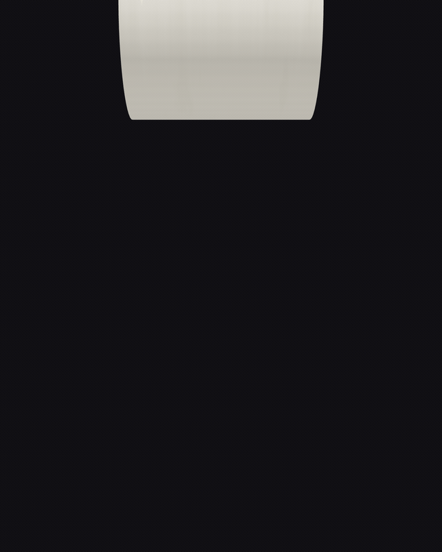
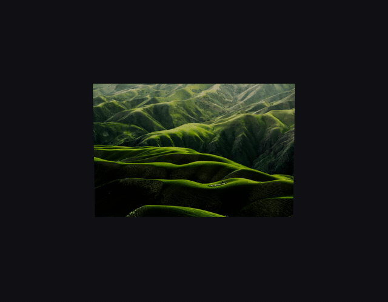
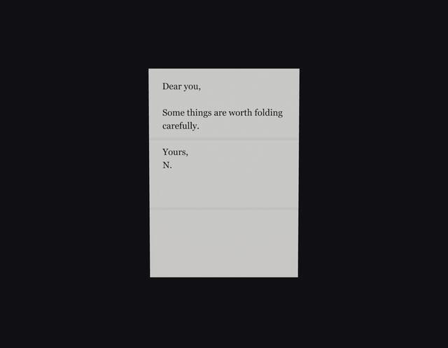
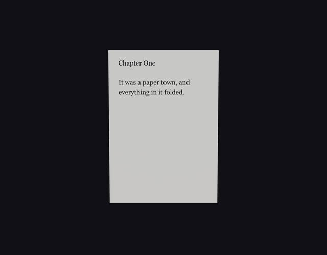
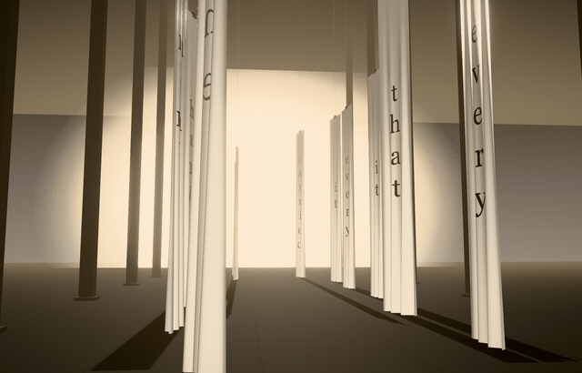

# Paperlab

**Physical, realistic paper as a React component.** A hero image that peels, a receipt that unrolls, a letter that folds, a poster rippling in wind, a gallery ring of prints — real 3D paper, not a CSS fake. Content is a texture on a mesh that genuinely bends, so text and imagery curl with perfect continuity.

**[Try it →](https://nourmtir0722.github.io/Paperlab/)**  ·  [the editor](https://nourmtir0722.github.io/Paperlab/editor/)  ·  [the reference](https://nourmtir0722.github.io/Paperlab/docs/)  ·  [for agents](AGENTS.md)

| | |
|---|---|
|  |  |
|  |  |

Every frame above is real geometry — no video, no sprite sheet. Type a sentence into the playground and it builds you a room out of it:



## Quick start

```sh
npm i paperlab three @react-three/fiber gsap
```

```tsx
import { Paper } from 'paperlab'

// One line. (The parent element needs a height — <Paper> fills it.)
<Paper preset="receipt-unroll" autoplay />
```

Or sculpt your own:

```tsx
<Paper
  sheet={{ width: 1, height: 2.6 }}
  stock="thermal"
  content={{ type: 'receipt', store: 'your.store', items: [{ name: 'Thing', price: 12 }] }}
  behavior={{ type: 'unroll', progress: 0.6, tightness: 0.5 }}
  surface={{ deckle: { edges: ['bottom'] } }}
  interactive
  autoplay
/>
```

Galleries are one component too:

```tsx
import { PaperField } from 'paperlab'

<PaperField images={photos} preset="photo-print" layout="ring" />
```

Or build a space out of a sentence and walk through it:

```tsx
import { PaperStage } from 'paperlab'

<PaperStage text="the paper remembers every hand that folded it" progress={scroll} />
```

## What's inside

- **Behaviors** — `peel`, `unroll`, `flip`, `letter-fold`, `hang`, `fly`, `fall`, `carry`, `flight`, `crumple`: human-named params ('tightness', not 'cylinderRadius') over a stack of pure geometry deformers. Draggable handles when `interactive`.
- **Stocks & surfaces** — seven paper stocks (thermal gets banding, newsprint gets grain) plus grain, torn deckle edges, crease lines, and aging as composable shader effects. Real lighting throughout.
- **Physics** — curated idle motion (`float`, `tumble`, `breeze`…) that composes with behaviors, and a verlet **cloth** mode: pin the top edge, add wind, grab the sheet and pull.
- **Field mode** — 10+ papers render as *one instanced draw call* with the deformers running on the GPU (parity-tested against the CPU path), arranged by pure layout functions. Every layout names somewhere paper actually sits: `book` (pages splayed from a spine — `split: 0` makes it a swatch deck), `accordion` (one continuous concertina strip), `fan` (a hand of cards), `spread` (a stack slid sideways), `pile` (a heap on a desk), `rack` (prints stood in a row, leaning back), `wall` (a pinned studio wall), `spill` (a dropped stack mid-air), `colonnade` (banners arranged along a walk, for stage mode), plus `ring`, `sheet`, and `sweep` — a specimen chart of one sheet at ten stages of the same curl. Each pose carries a **bias** — how strongly that one sheet takes the deformation — so the top of a pile curls while the sheets pressed underneath lie flat, in the same draw call. The camera frames itself from the layout's own poses, so a wide `wall` and a deep `ring` both land without hand-tuning.
- **Stage mode** — paper as *architecture*: banners hung along a walk, a figure walking down it, light coming through the paper from the far end. `<PaperStage text="…" />` builds the whole space out of a sentence, and binding `progress` to scroll makes the page scroll the walk. Every part of the scene — the arrangement, the figure, the camera, the light source — reads the same walk, so they cannot drift apart. Quality adapts to the machine on its own.
- **Lighting you can actually light with** — a preset is the starting point, not the ceiling. `light={{ exposure, key, color, direction, height, ambient, studio, haze }}` moves the lamp in the terms a person would say it in (degrees around the room, degrees above the horizon), and **studio** is the room itself as an environment map, which is what gives paper directional fill and something for its sheen to reflect. Overrides serialize as overrides, so a shared scene carries the two sliders you moved rather than a frozen copy of a rig you never touched.
- **Presets** — everything serializes to `.paper` JSON validated by a zod schema. Diffable, forkable, shareable.
- **Agent-first export** — the editor's **Copy for AI** button produces a self-contained brief you paste into Claude Code (or any coding agent): install line, inlined component, placement contract, and a verification step the agent can self-check. See [AGENTS.md](AGENTS.md).
- **Accessible by default** — `prefers-reduced-motion` freezes behaviors at their pose, a hidden DOM mirror carries the content for screen readers, and a flat DOM fallback renders when WebGL isn't available.

## The editor

```sh
pnpm install && pnpm dev   # → localhost:5173
```

A Figma-shaped editor: presets on the left, sculpt on canvas (drag the blue handles), inspector on the right, transport at the bottom (space = play/pause). Field mode composes galleries; **Export code** ends the session in your codebase.

## Papers are made to be passed around

A paper is data — a `.paper` JSON object validated by a zod schema — so it travels without asking anyone's permission. **You do not need to fork this repo to share one.**

**Sending one.** Sculpt a paper in the [editor](https://nourmtir0722.github.io/Paperlab/editor/) and hit **Share**: you get a link with the whole paper packed into it. Anyone who opens that link lands in their own editor with your paper loaded and *editable* — a fork, not a read-only view. Paste it in a thread, a PR, a Discord. (Uploaded images are too big for a URL; use the ⬇ download and send the `.paper` file instead.)

**Receiving one.** Open the link, or drag a `.paper` file onto the preset panel. Either way it lands in your library next to the built-ins, ready to take apart.

**Using one in your project.** A `.paper` file is a preset object, so it goes straight in:

```tsx
import alice from './alice-note.paper.json'

<Paper preset={alice} autoplay />
```

Or register it once by name and refer to it everywhere:

```tsx
import { registerPreset } from 'paperlab'

registerPreset('alice-note', alice)
<Paper preset="alice-note" />
```

That's the whole loop: **make → send → remix → ship.** If you'd rather your paper shipped *with* the library so everyone gets it by name, that's the first rung of [CONTRIBUTING.md](CONTRIBUTING.md) — a preset PR is JSON and no code.

## Repository

| | |
|---|---|
| [`packages/paperlab`](packages/paperlab/) | the npm library |
| [`apps/editor`](apps/editor/) | the editor |
| [`apps/playground`](apps/playground/) | the playground — one input, one scene, shareable by link |
| [`docs/llms.txt`](docs/llms.txt) | the agent-readable API reference |
| [`docs/roadmap.md`](docs/roadmap.md) | what this is, what's decided, and what's next |

```sh
pnpm test           # unit suite — deformer math, schema, cloth, layouts, exports
pnpm test:parity    # GPU golden-vector gate: every deformer's GLSL twin vs its JS twin
pnpm build
```

Contributions climb a ladder from presets (JSON only) to dual-implementation deformers — see [CONTRIBUTING.md](CONTRIBUTING.md).

Apache 2.0 © Noor Mtir — attribution travels with the code: redistributions must reproduce the [NOTICE](NOTICE) file. If Paperlab made it into something you shipped, a visible credit or link back is warmly appreciated.
